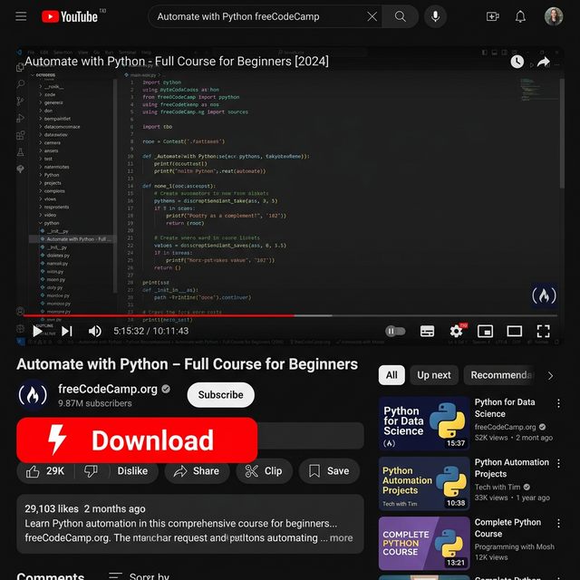
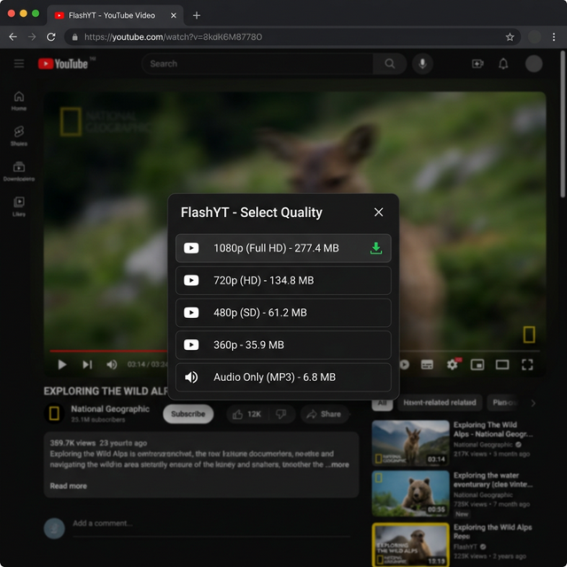
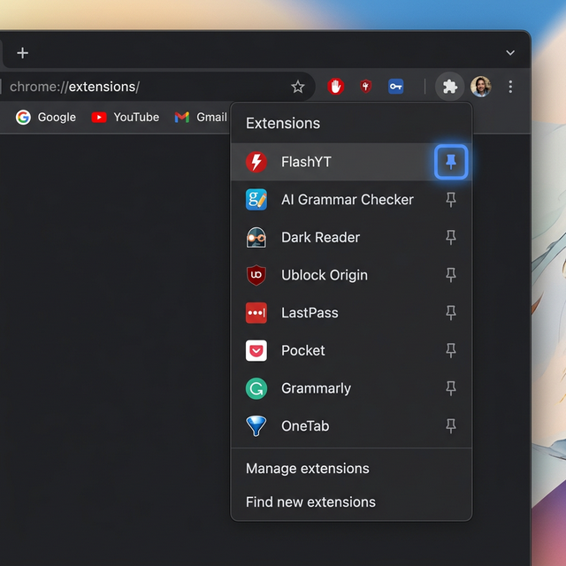
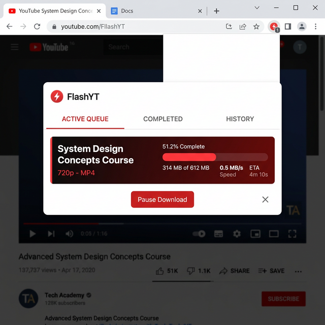

# ⚡ FlashYT — Installation Guide (v2.2.2)

> **Download YouTube videos in any quality, directly from your browser. No accounts. No cloud. Completely free.**


[](https://github.com/aazannoorkhuwaja/FlashYT/releases/latest)
[](LICENSE)
[]()

---

## ✨ Why FlashYT?

FlashYT is built to **just work** — for everyone, on every computer, in every browser.

- **⚡ One-click download** — A friendly Download button appears directly under YouTube videos!
- **🎯 Exact quality** — Get exactly what you pick, from **1080p to 4K/8K Ultra HD**.
- **📊 Live progress** — See speeds, percentages, and time remaining in real-time.
- **🖥️ System Tray** — Windows tray icon for quick status and logs.
- **🔒 100% private** — Videos save straight to your computer. No servers.
- **🆓 Free & open source** — Yours to use forever!

---

## 🪟 Windows Setup

**Total time: ~2 minutes. No technical knowledge needed.**

### Step 1 — Download the Installer
Go to the [FlashYT Releases page](https://github.com/aazannoorkhuwaja/FlashYT/releases/latest) and download **`FlashYT-setup.exe`**.

### Step 2 — Run It
Double-click the file. If Windows shows a blue "Windows protected your PC" warning, click **More info** → **Run anyway**. (It's normal for open-source software).

### Step 3 — Click Next
Follow the installer prompts. It automatically sets everything up for Chrome, Brave, and Edge.

### Step 4 — Restart Your Browser
Close your browser **completely** (all windows), then open it again.

### Step 5 — You're Done! 🎉
Open any YouTube video. You'll see the red **⚡ Download** button below the player.

---

## 🍎 Mac / 🐧 Linux Setup

**Total time: ~3 minutes. You'll need to type 3 lines into Terminal.**

### Step 1 — Load the Extension
1. Download the [FlashYT ZIP](https://github.com/aazannoorkhuwaja/FlashYT/archive/refs/heads/main.zip) and extract it.
2. Go to `chrome://extensions`, turn on **Developer mode**, and click **Load unpacked**.
3. Select the **`extension`** folder from the extracted ZIP.

### Step 2 — Run the Helper
Open **Terminal** and run these 3 lines one by one:

```bash
curl -L -o install.sh https://raw.githubusercontent.com/aazannoorkhuwaja/FlashYT/main/install.sh
chmod +x install.sh
bash install.sh
```

### Step 3 — Reload & Enjoy!
Go back to `chrome://extensions` and click the **🔄 reload icon** on FlashYT. You're ready!

---

## 🎬 Proof of Work

| Feature | Preview |
|---|---|
| **One-Click Button** |  |
| **Quality Selector** |  |
| **Pin for Quick Access** |  |
| **Active Queue** |  |

---

## ⚙️ Configuration (.env)
FlashYT uses a `.env` file for optional settings. See `.env.example` to configure:
- `FLASHYT_INNERTUBE_KEY`: For faster quality prefetching.
- `FLASHYT_MAX_CONCURRENT`: Limit simultaneous download streams.

---

## 🔧 Troubleshooting

### "Host not connected"
Re-run the installer/script and reload the browser extension.

### Download Stuck at 0%
YouTube update detected! Simply re-run the `install.sh` or `setup.exe` to get the latest fix instantly.

---

## 🐛 Need Help?
[Open an issue on GitHub](https://github.com/aazannoorkhuwaja/FlashYT/issues) or check the logs at:
- **Mac/Linux:** `~/.config/YouTubeNativeExt/host.log`
- **Windows:** `%APPDATA%\YouTubeNativeExt\host.log`

---

## 📄 License
MIT — free to use and modify. See [LICENSE](LICENSE).

---

*Vibe Coded by [Aazan Noor Khuwaja](https://www.linkedin.com/in/aazan-noor-khuwaja-cs/)*
